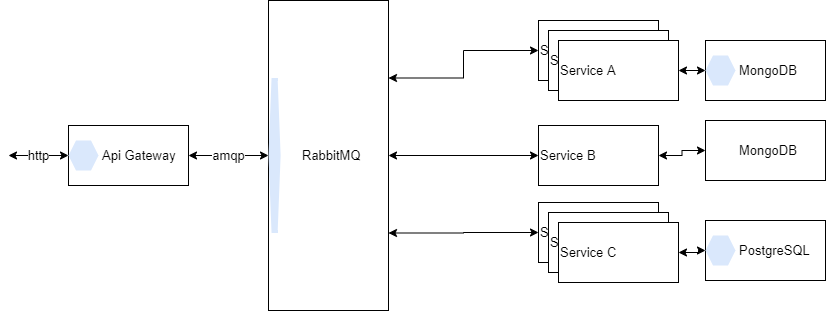

# Project description
This should be really basic microservice chassis for work with RabbitMq. It is using [EasyNetQ](https://github.com/EasyNetQ/EasyNetQ) API for [RabbitMQ](https://www.rabbitmq.com/).

Feel free to ask questions and start issues or offer some pull requests to improve this.

## Current limitations
EasyNetQ doesn't offer method to unsubscribe, so graceful shutdown may be an issue with more subscribers in one Microservice. Otherwise I would add Unsubscribe call to `SubscriberService.cs` on `StopAsync`. Although I do not expect that it might corrupt any data since RabbitMq is as safe as possible.

## Projects
Whole solution consists of following projects.

### Messages project
This is shared library across microservices. It contains messages that are going through RabbitMq.

### RabbitMqHostedService
This is another shared library - basically it is Hosted service wrapper arround EasyNetQ library.

### Publisher
Hello world like console application to put some messages into queue. There you can see how to publish messages.

### Microservice
Lightweight (basic) microservice where. It processes every message that goes to its queue.

## Big picture
Simple microservice architecture

## Environment setting
First you need to install docker (or RabbitMQ) on your machine. In case of docker - you can run RabbitMq with following command `docker run -d --name myrabbit -p 5672:5672 -p 15672:15672 rabbitmq:3.8.5-management-alpine`.

## Running projects in order
1) Run Microservice project at first - it will register consumer queue. You can leave it running.
2) Run Publisher - this will send some messages to consumer's queue.
3) Watch Microservice's stdout

